ISLR, Chapter 10
================

-   [Exercise 1](#exercise-1)
-   [Exercise 2](#exercise-2)
-   [Exercise 3](#exercise-3)
-   [Exercise 4](#exercise-4)
-   [Exercise 5](#exercise-5)
-   [Exercise 6](#exercise-6)
-   [Exercise 7](#exercise-7)
-   [Exercise 8](#exercise-8)
-   [Exercise 9](#exercise-9)
-   [Exercise 10](#exercise-10)
-   [Exercise 11](#exercise-11)

### Exercise 1

------------------------------------------------------------------------

### Exercise 2

------------------------------------------------------------------------

### Exercise 3

------------------------------------------------------------------------

### Exercise 4

------------------------------------------------------------------------

### Exercise 5

------------------------------------------------------------------------

### Exercise 6

------------------------------------------------------------------------

### Exercise 7

``` r
data(USArrests)

# Transpose data set to center observations, not covariates
us.scaled <- scale(t(USArrests))

# Euclidean distance between states
eud <- dist(t(us.scaled))

# Correlation distance between states
cord <- as.dist(1-cor(us.scaled))

# Plot shows strong non-linear relationship between the 2 sets of values
plot(eud, cord, main="USArrests: distance between scaled observations", xlab="Euclidean distance", ylab="Correlation distance")
lines(lowess(eud, cord), lwd=2, col='red')
abline(lm(cord~eud), col='blue', lwd=2)
legend("bottomright", legend=c("linear model", "lowess"), col=c("blue", "red"), lwd=2)
```

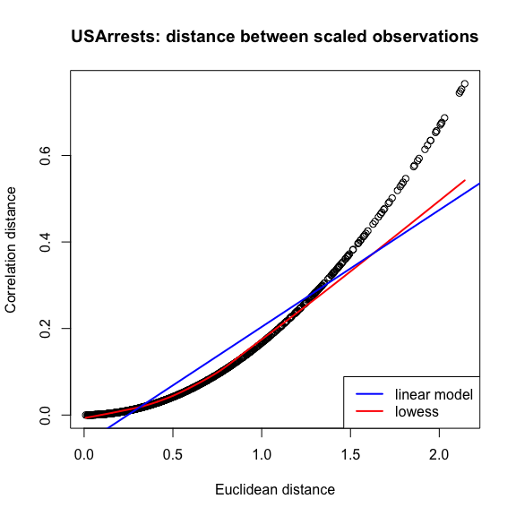

``` r
# Correlation between the 2 distances is also very high
cor(eud, cord)
```

    ## [1] 0.9449967

------------------------------------------------------------------------

### Exercise 8

``` r
us.scaled <- scale(USArrests)

# PVE from output of prcomp
pc <- prcomp(us.scaled, center=TRUE, scale=TRUE)
pve1 <- summary(pc)$importance[2,]

# PVE from Eq. 10.8
x <- us.scaled %*% pc$rotation
component_var <- apply(x^2, 2, sum)
total_var <- sum(apply(us.scaled^2, 2, sum))
pve2 <- component_var/total_var

# Both sets of values are equal up to roundoff error
pve1-pve2 < 10^-5
```

    ##  PC1  PC2  PC3  PC4 
    ## TRUE TRUE TRUE TRUE

------------------------------------------------------------------------

### Exercise 9

*a/b:* Hierarchical clustering of `USArrests` without scaling

``` r
data(USArrests)

d <- dist(USArrests)
hc <- hclust(d, method="complete")

plot(hc)
abline(h=125, col='red', lwd=2)
```

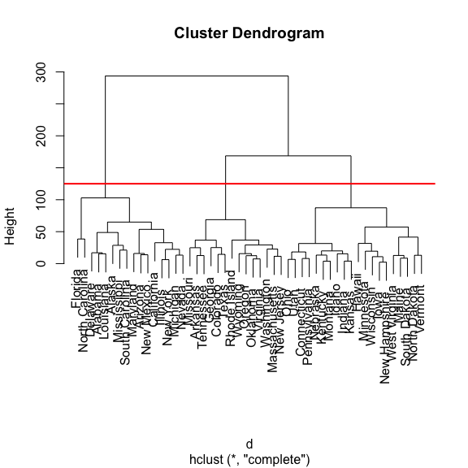

Splitting the hierarchical cluster above into 3 clusters results in the split below:

**Cluster 1**

-   Florida
-   North Carolina
-   Delaware
-   Alabama
-   Louisiana
-   Alaska
-   Mississippi
-   South Carolina
-   Maryland
-   Arizona
-   New Mexico
-   California
-   Illinois
-   New York
-   Michigan
-   Nevada

**Cluster 2**

-   Missouri
-   Arkansas
-   Tennessee
-   Georgia
-   Colorado
-   Texas
-   Rhode Island
-   Wyoming
-   Oregon
-   Oklahoma
-   Virginia
-   Washington
-   Massachusetts
-   New Jersey

**Cluster 3**

-   Ohio
-   Utah
-   Connecticut
-   Pennsylvania
-   Nebraska
-   Kentucky
-   Montana
-   Idaho
-   Indiana
-   Kansas
-   Hawaii
-   Minnesota
-   Wisconsin
-   Iowa
-   New Hampshire
-   West Virginia
-   Maine
-   South Dakota
-   North Dakota
-   Vermont

*c/d:* Hierarchical clustering after scaling data

``` r
us.scaled <- scale(USArrests, center=TRUE, scale=TRUE)
d2 <- dist(us.scaled)
hc2 <- hclust(d2, method="complete")
plot(hc2)
```

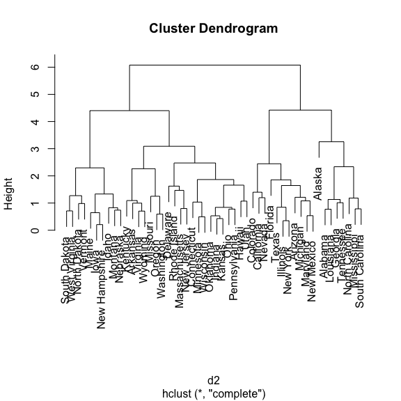

Centering and scaling the covariates changes the structure of the tree. It is no longer possible to group the states into just 3 clusters. It also results in better grouping of similar states together and should always be done for this data set.

------------------------------------------------------------------------

### Exercise 10

*a:* Generate simulated data. Heatmap below shows that data in the 3 groups are well separated. (based on hierarchical clustering on left Y-axis).

``` r
set.seed(1)
data <- matrix(nrow=60, ncol=50)

for (i in 1:ncol(data)) {
  mean <- sample(1:100, size=1)
  data[1:20,i] <- rnorm(20, mean=mean/1.5)
  data[21:40,i] <- rnorm(20, mean)
  data[41:60,i] <- rnorm(20, mean*1.5)
}

heatmap(data)
```

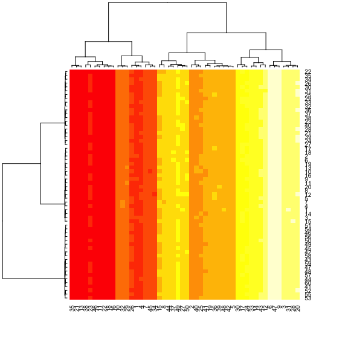

``` r
truth <- c(rep(1,20), rep(2,20), rep(3,20))
```

*b:* PCA on simulated data.

The 3 groups are well separated in the 1st PC, which acounts for almost all the variation in the data.

``` r
pc <- prcomp(data, center=TRUE, scale=TRUE)
biplot(pc, scale=0)
```

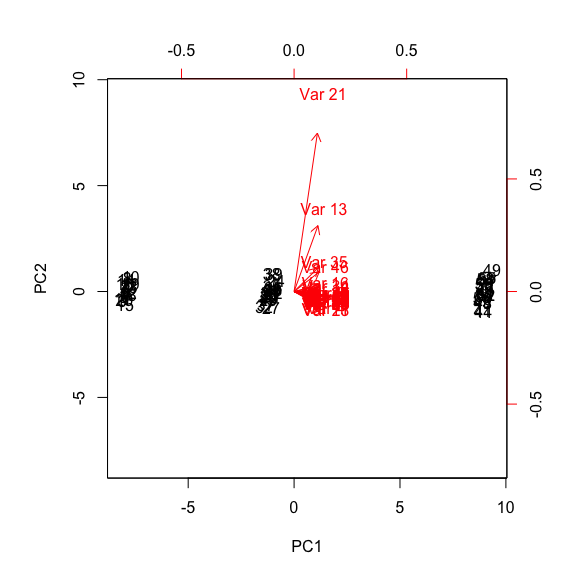

``` r
plot(pc$x[,1], pc$x[,2], col=c(rep("red",20), rep("blue",20), rep("forestgreen",20)), pch=16, xlab="PC 1", ylab="PC 2", main="Simulated data: PC 1 vs. PC 2")
```

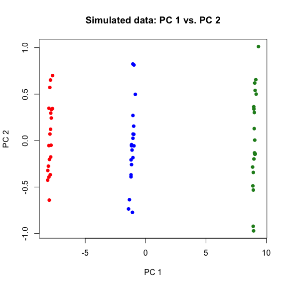

``` r
par(mfrow=c(1,2))
plot(summary(pc)$importance[2,], ylim=c(0,1), ylab="Proportion of Variance Explained", xlab="PC index", pch=16)
plot(summary(pc)$importance[3,], ylim=c(0,1), ylab="Cumulative Variation Explained", xlab="PC index", pch=16)
```

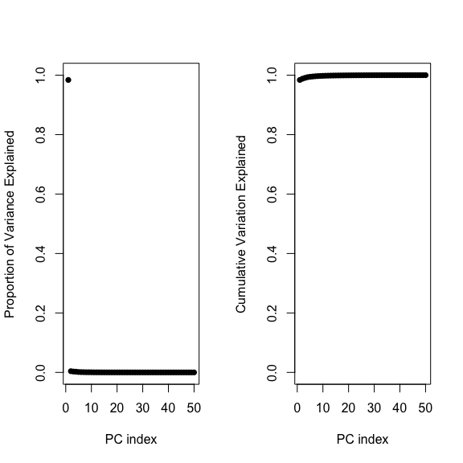

``` r
par(mfrow=c(1,1))
```

*c/d/e/f/g:* K-means on simulated data.

-   With `K = 3`, K-means combined 2 groups into a single cluster and split the 3rd group into 2 other clusters.
-   With `K = 2`, 2 groups remained together while the 3rd group was combined into a single cluster.
-   With `K = 4`, 2 groups were clustered correctly, while the 3rd group was split into 2 other clusters.
-   When clustering the 1st 2 principal components with `K = 3`, the groups were correctly clustered into 3 separate clusters. This is because the 1st PC accounted for almost all the variation in the data.
-   When clustering on scaled data, the groups were correctly clustered into 3 separate clusters. This is an improvement over clustering on non-scaled data suggesting that this data should be scaled before clustering.

``` r
# 3 clusters
k <- kmeans(data, centers=3)
table(truth, k$cluster)
```

    ##      
    ## truth  1  2  3
    ##     1 13  0  7
    ##     2  0 20  0
    ##     3  0 20  0

``` r
# 2 clusters
k <- kmeans(data, centers=2)
table(truth, k$cluster)
```

    ##      
    ## truth  1  2
    ##     1  0 20
    ##     2 20  0
    ##     3 20  0

``` r
# 4 clusters
k <- kmeans(data, centers=4)
table(truth, k$cluster)
```

    ##      
    ## truth  1  2  3  4
    ##     1  0 20  0  0
    ##     2  0  0  0 20
    ##     3  8  0 12  0

``` r
# 3 clusters on 1st 2 PCs
k <- kmeans(pc$x[,1:2], centers=3)
plot(pc$x[,1], pc$x[,2], col=k$cluster, pch=16, xlab="PC 1", ylab="PC 2", main="Simulated data: PC 1 vs. PC 2 \nK-Means on 1st 2 PCs: 3 clusters")
```

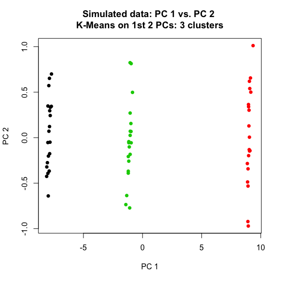

``` r
table(truth, k$cluster)
```

    ##      
    ## truth  1  2  3
    ##     1 20  0  0
    ##     2  0  0 20
    ##     3  0 20  0

``` r
# 3 clusters on scaled data
data.scaled = scale(data, center=FALSE, scale=TRUE)
k <- kmeans(data.scaled, centers=3)
table(truth, k$cluster)
```

    ##      
    ## truth  1  2  3
    ##     1 20  0  0
    ##     2  0  0 20
    ##     3  0 20  0

------------------------------------------------------------------------

### Exercise 11

Gene expression data is loaded from CSV file. Heatmap shows that expression values are different between the 2 groups for a subset of genes.

``` r
genes <- read.csv("Ch10Ex11.csv", header=F)
heatmap(as.matrix(genes), Rowv=NA, Colv=NA)
abline(v=16, lwd=2)
```

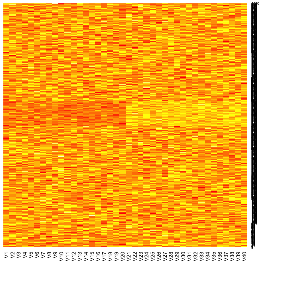

*b:* Hierarchical clustering for samples. Tree structure for samples depends strongly on the type of linkage used. There is no clear separation of samples into the correct groups (1-20, 21-40) based on gene expression values in any of the trees obtained. This was the case regardless of the type of linkage used and whether data was scaled or not.

``` r
# d <- as.dist(cor(scale(genes)))
d <- as.dist(cor(genes))

# Complete Linkage
hc <- hclust(d, method="complete")
plot(hc)
```

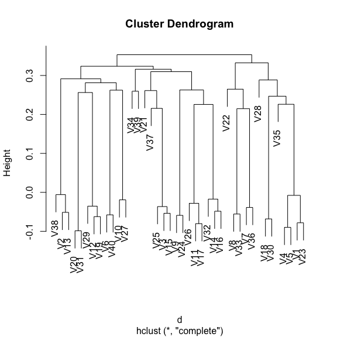

``` r
# Average Linkage
hc <- hclust(d, method="average")
plot(hc)
```

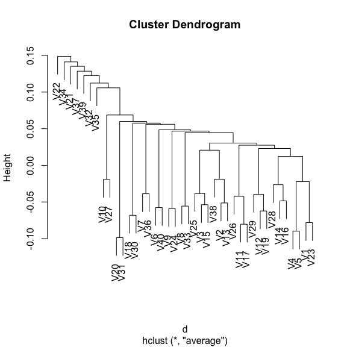

``` r
# Single Linkage
hc <- hclust(d, method="single")
plot(hc)
```

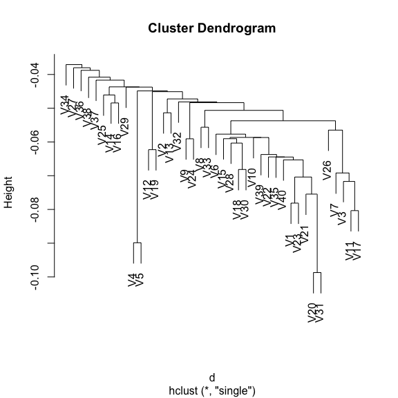

``` r
# Centroid Linkage
hc <- hclust(d, method="centroid")
plot(hc)
```

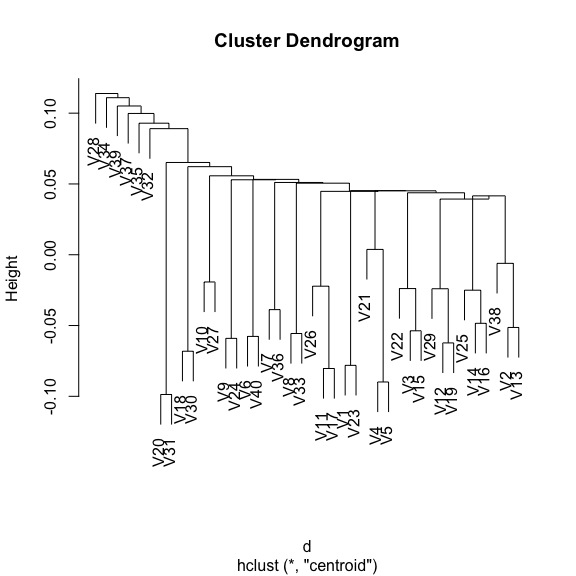

However, K-Means was able to correctly separate the 2 groups.

``` r
k<- kmeans(t(genes), centers=2)
k$cluster
```

    ##  V1  V2  V3  V4  V5  V6  V7  V8  V9 V10 V11 V12 V13 V14 V15 V16 V17 V18 
    ##   1   1   1   1   1   1   1   1   1   1   1   1   1   1   1   1   1   1 
    ## V19 V20 V21 V22 V23 V24 V25 V26 V27 V28 V29 V30 V31 V32 V33 V34 V35 V36 
    ##   1   1   2   2   2   2   2   2   2   2   2   2   2   2   2   2   2   2 
    ## V37 V38 V39 V40 
    ##   2   2   2   2

*c:* From the heatmap above, a group of genes in the middle has different expression values compared to the genes above and below. Running K-Means with 2 clusters will allow us to identify the genes that have different expression values. The result of K-Means with 2 clusters suggests than the genes 11-20 and 500 - 600 differ the most between the 2 groups.

This is confirmed by running principal components. The 1st principal component explains ~ 20% of the variation in the data and separates the 2 groups. Coloring the points by the clusters generated by K-Means shows that the K-Means clusters the 2 groups correctly.

``` r
k2 <- kmeans(genes, centers=2, nstart=20)
k2$cluster
```

    ##    [1] 2 2 2 2 2 2 2 2 2 2 1 1 1 1 1 1 1 1 1 1 2 2 2 2 2 2 2 2 2 2 2 2 2 2
    ##   [35] 2 2 2 2 2 2 2 2 2 2 2 2 2 2 2 2 2 2 2 2 2 2 2 2 2 2 2 2 2 2 2 2 2 2
    ##   [69] 2 2 2 2 2 2 2 2 2 2 2 2 2 2 2 2 2 2 2 2 2 2 2 2 2 2 2 2 2 2 2 2 2 2
    ##  [103] 2 2 2 2 2 2 2 2 2 2 2 2 2 2 2 2 2 2 2 2 2 2 2 2 2 2 2 2 2 2 2 2 2 2
    ##  [137] 2 2 2 2 2 2 2 2 2 2 2 2 2 2 2 2 2 2 2 2 2 2 2 2 2 2 2 2 2 2 2 2 2 2
    ##  [171] 2 2 2 2 2 2 2 2 2 2 2 2 2 2 2 2 2 2 2 2 2 2 2 2 2 2 2 2 2 2 2 2 2 2
    ##  [205] 2 2 2 2 2 2 2 2 2 2 2 2 2 2 2 2 2 2 2 2 2 2 2 2 2 2 2 2 2 2 2 2 2 2
    ##  [239] 2 2 2 2 2 2 2 2 2 2 2 2 2 2 2 2 2 2 2 2 2 2 2 2 2 2 2 2 2 2 2 2 2 2
    ##  [273] 2 2 2 2 2 2 2 2 2 2 2 2 2 2 2 2 2 2 2 2 2 2 2 2 2 2 2 2 2 2 2 2 2 2
    ##  [307] 2 2 2 2 2 2 2 2 2 2 2 2 2 2 2 2 2 2 2 2 2 2 2 2 2 2 2 2 2 2 2 2 2 2
    ##  [341] 2 2 2 2 2 2 2 2 2 2 2 2 2 2 2 2 2 2 2 2 2 2 2 2 2 2 2 2 2 2 2 2 2 2
    ##  [375] 2 2 2 2 2 2 2 2 2 2 2 2 2 2 2 2 2 2 2 2 2 2 2 2 2 2 2 2 2 2 2 2 2 2
    ##  [409] 2 2 2 2 2 2 2 2 2 2 2 2 2 2 2 2 2 2 2 2 2 2 2 2 2 2 2 2 2 2 2 2 2 2
    ##  [443] 2 2 2 2 2 2 2 2 2 2 2 2 2 2 2 2 2 2 2 2 2 2 2 2 2 2 2 2 2 2 2 2 2 2
    ##  [477] 2 2 2 2 2 2 2 2 2 2 2 2 2 2 2 2 2 2 2 2 2 2 2 2 1 1 1 1 1 1 1 1 1 1
    ##  [511] 1 1 1 1 1 1 1 1 1 1 1 1 1 1 1 1 1 1 1 1 1 1 1 1 1 1 1 1 1 1 1 1 1 1
    ##  [545] 1 1 1 1 1 1 1 1 1 1 1 1 1 1 1 1 1 1 1 1 1 1 1 1 1 1 1 1 1 1 1 1 1 1
    ##  [579] 1 1 1 1 1 1 1 1 1 1 1 1 1 1 1 1 1 1 1 1 1 1 2 2 2 2 2 2 2 2 2 2 2 2
    ##  [613] 2 2 2 2 2 2 2 2 2 2 2 2 2 2 2 2 2 2 2 2 2 2 2 2 2 2 2 2 2 2 2 2 2 2
    ##  [647] 2 2 2 2 2 2 2 2 2 2 2 2 2 2 2 2 2 2 2 2 2 2 2 2 2 2 2 2 2 2 2 2 2 2
    ##  [681] 2 2 2 2 2 2 2 2 2 2 2 2 2 2 2 2 2 2 2 2 2 2 2 2 2 2 2 2 2 2 2 2 2 2
    ##  [715] 2 2 2 2 2 2 2 2 2 2 2 2 2 2 2 2 2 2 2 2 2 2 2 2 2 2 2 2 2 2 2 2 2 2
    ##  [749] 2 2 2 2 2 2 2 2 2 2 2 2 2 2 2 2 2 2 2 2 2 2 2 2 2 2 2 2 2 2 2 2 2 2
    ##  [783] 2 2 2 2 2 2 2 2 2 2 2 2 2 2 2 2 2 2 2 2 2 2 2 2 2 2 2 2 2 2 2 2 2 2
    ##  [817] 2 2 2 2 2 2 2 2 2 2 2 2 2 2 2 2 2 2 2 2 2 2 2 2 2 2 2 2 2 2 2 2 2 2
    ##  [851] 2 2 2 2 2 2 2 2 2 2 2 2 2 2 2 2 2 2 2 2 2 2 2 2 2 2 2 2 2 2 2 2 2 2
    ##  [885] 2 2 2 2 2 2 2 2 2 2 2 2 2 2 2 2 2 2 2 2 2 2 2 2 2 2 2 2 2 2 2 2 2 2
    ##  [919] 2 2 2 2 2 2 2 2 2 2 2 2 2 2 2 2 2 2 2 2 2 2 2 2 2 2 2 2 2 2 2 2 2 2
    ##  [953] 2 2 2 2 2 2 2 2 2 2 2 2 2 2 2 2 2 2 2 2 2 2 2 2 2 2 2 2 2 2 2 2 2 2
    ##  [987] 2 2 2 2 2 2 2 2 2 2 2 2 2 2

``` r
pc <- prcomp(genes, center=TRUE, scale. = TRUE)

par(mfrow=c(2,2))
biplot(pc)
plot(pc$x[,1], pc$x[,2], col=k2$cluster, pch=16, xlab="PC 1", ylab="PC 2")
plot(summary(pc)$importance[2,], type='l', lwd=2, ylab="Proportion Variance Explained", ylim=c(0,1))
plot(summary(pc)$importance[3,], type='l', lwd=2, ylab="Cumulative Variance Explained", ylim=c(0,1))
```

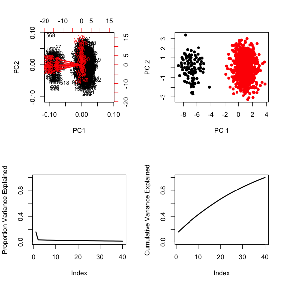

``` r
par(mfrow=c(1,1))
```
